# Food Ordering

## 📄 Description User Page

- ### **Home page Food Ordering**, Giới thiệu cửa hàng, **Menu sản phẩm, Blog của cửa hàng, Tạo mới, kiểm tra và gửi câu hỏi kèm thông tin liên hệ cho cửa hàng**

## ✨ Feature

### **_Home Page_** - **_Trang chủ_** gồm có 5 phần

> ### 1. Home

- ***Main interface***: _Giao diện chính_
  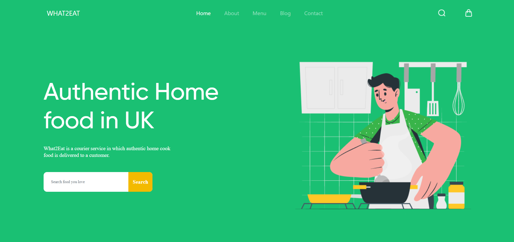
- ***Menubar***: _Thanh menu luôn cố định ở trên cùng để người dùng luôn dễ dàng thao tác. Ngoài ra khi bấm vào các lựa chọn trên thanh menu thì trang web sẽ tự động trỏ đến các phần tương ứng_
  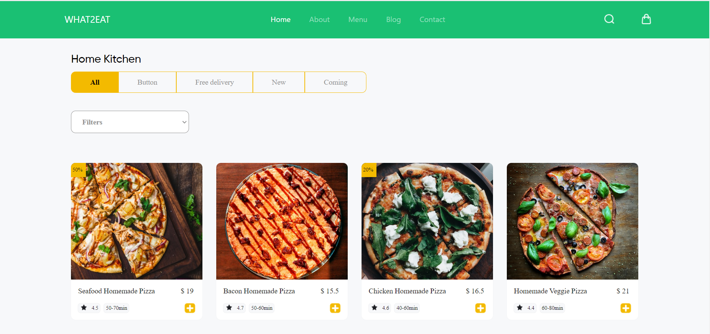
- ***Menubar input search***: _Khi bấm vào biểu tượng tìm kiếm trên thanh menu sẽ hiển thị ra ô tìm kiếm. Khi bấm ra vùng khác thì sẽ ẩn đi_
  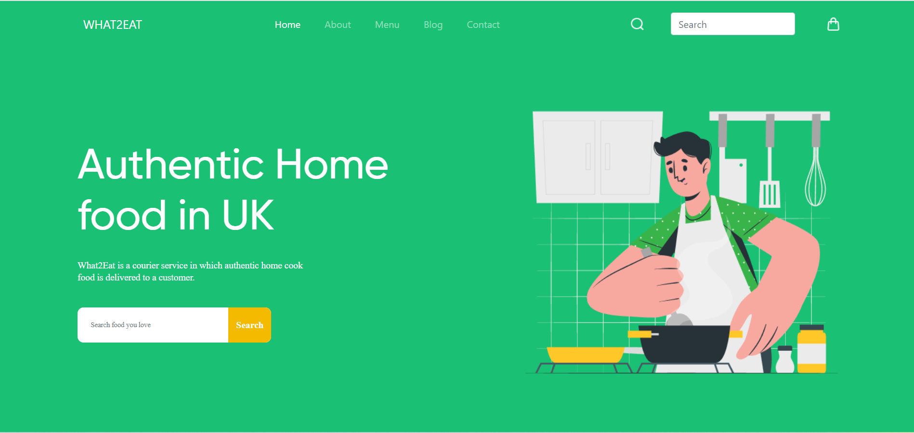
- ***Menubar add to cart***: _Khi có sản phẩm trong giỏ hàng, biểu tượng giỏ hàng trên thanh menu sẽ chuyển từ màu trắng thành màu vàng. Khi bấm vào sẽ chuyển sang tab giỏ hàng(trong 1 tab mới)_
  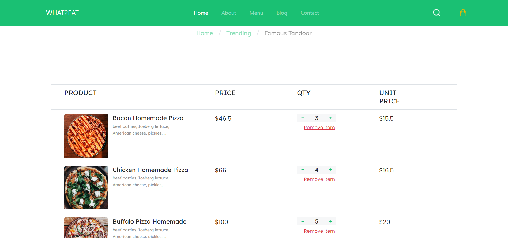
- ***Responsive***: _Giao diện tương thích với nhiều kích cỡ màn hình. Thanh menu cũng thay đổi theo kích cỡ màn hình khác nhau_
  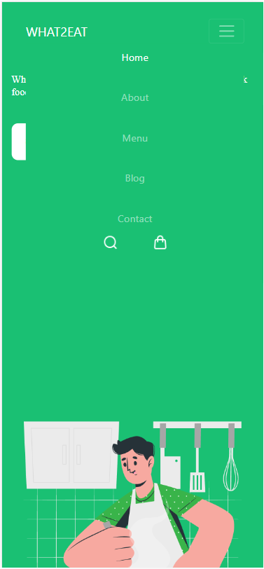

> ### 2. Menu

- ***Main interface***: _Giao diện chính_
  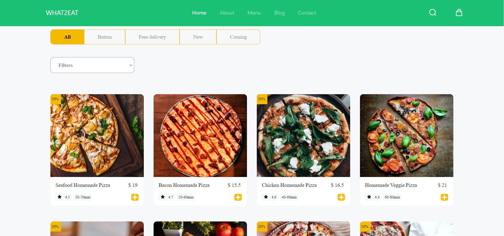
- ***Filter***: _Bộ lọc sản phẩm có 1 thẻ select và 1 tập hợp các button có giá trị tương ứng nhau. Khi bấm 1 button bất kì thì sẽ thay đổi giao diện của chính nó và các button còn lại. Ngoài ra cũng thay đổi luôn thẻ select thành giá trị tương ứng với button được bấm. Tương tự khi chọn 1 option bất kỳ trong thẻ select thì button tương ứng cũng được thay đổi thành button được chọn_
  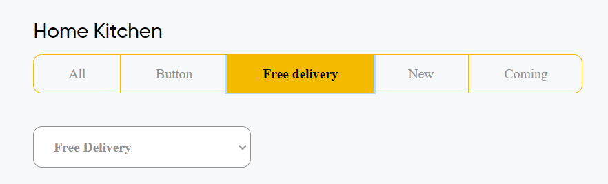
- ***Responsive***: _Giao diện tương thích với nhiều kích cỡ màn hình. Thanh button cũng có tính năng cuộn để không bị vỡ kết cấu giao diện khi sử dụng màn hình mobile_
  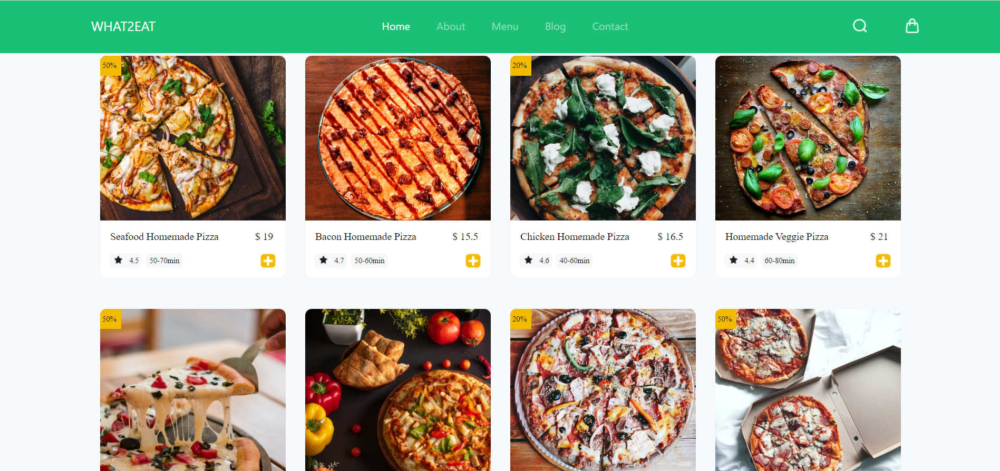
  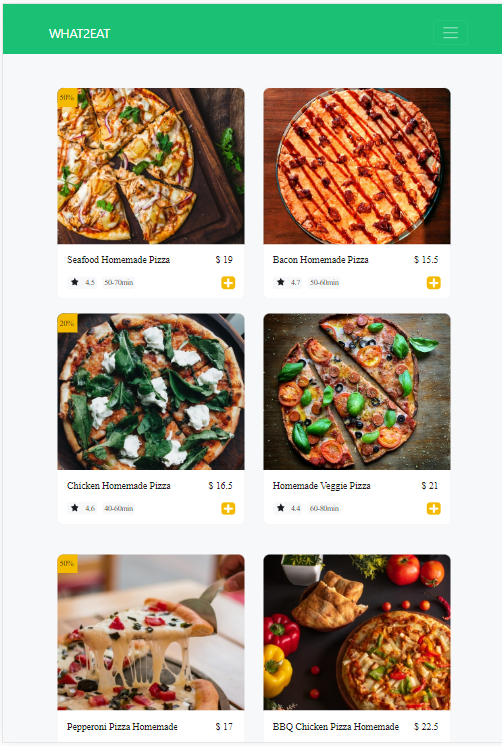
  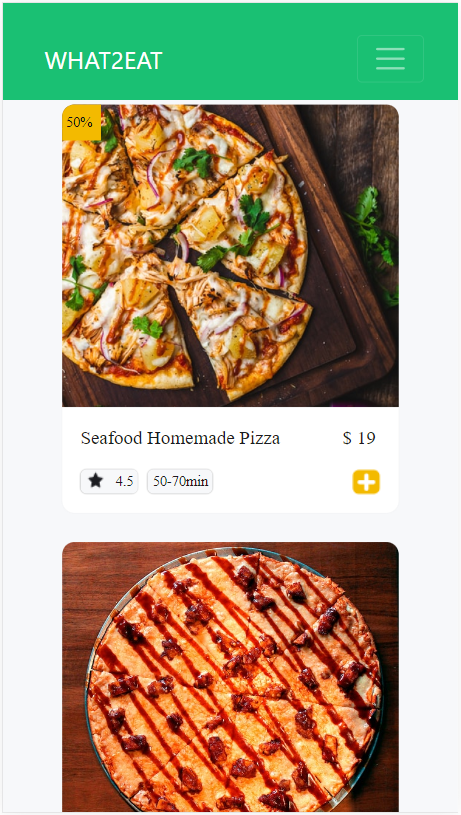
  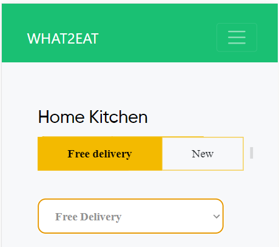
- ***Tooltip Overflow***: _Khi nội dung bị dài quá thẻ cha thì phần vượt quá sẽ thay bằng dấu ... Khi trỏ chuột vào ... sẽ hiển thị lên 1 bảng nhỏ chứa toàn bộ nội dung phần văn bản đó_
  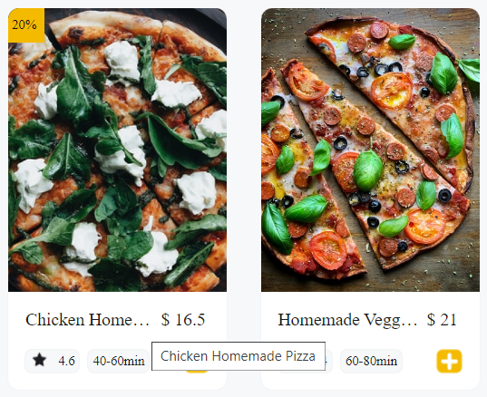
- ***Add To Cart***: _Khi bấm vào biểu tượng dấu + ở mỗi sản phẩm thì sẽ thêm sản phẩm đó vào giỏ hàng rồi thông báo đến người dùng. Mỗi lần bấm sẽ thêm 1 sản phẩm. Nếu sản phẩm đó đã tồn tại trong giỏ hàng thì sẽ cộng thêm 1 vào số lượng_
  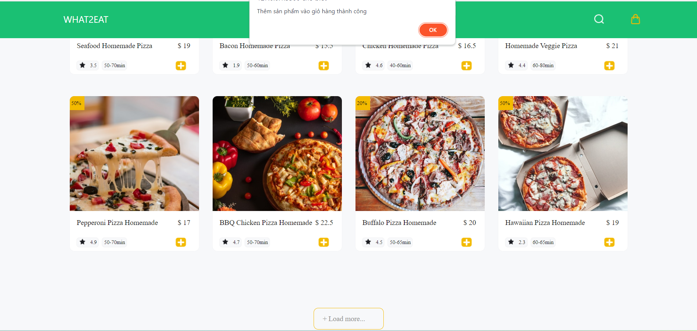
- ***Error***: _Khi tải trang sẽ lấy thông tin các sản phẩm pizza từ server về và load vào phần menu. Khi xảy ra lỗi không lấy được thông tin sẽ thông báo đến người dùng_
  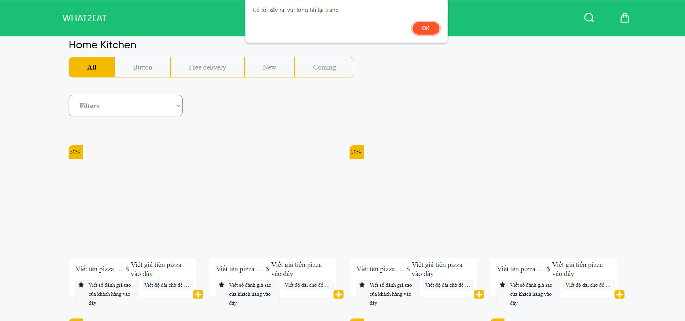

> ### 3. Blog

- ***Main interface***: _Giao diện chính_
  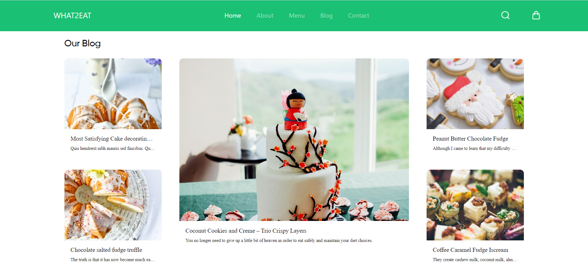
- ***Responsive***: _Giao diện tương thích với nhiều kích cỡ màn hình_
  
  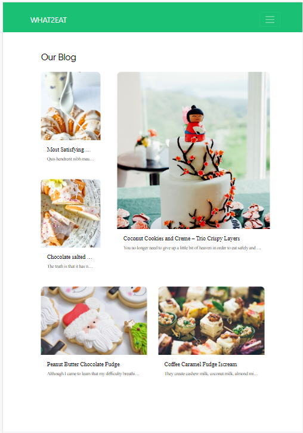
  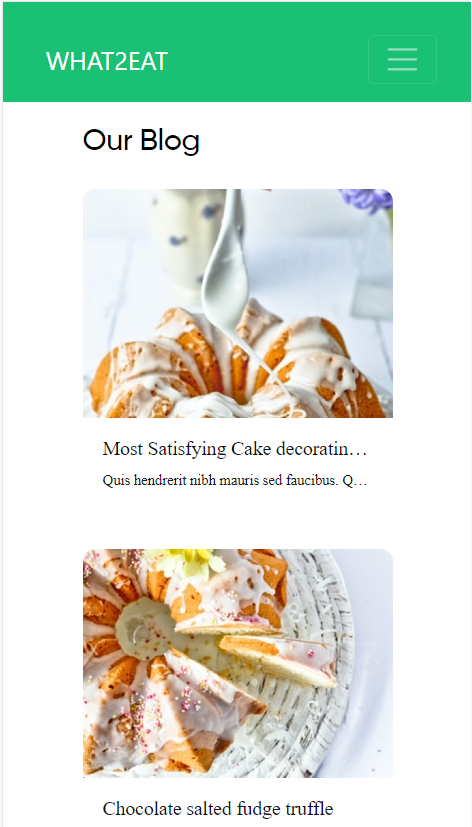
- ***Tooltip Overflow***: _Khi nội dung bị dài quá thẻ cha thì phần vượt quá sẽ thay bằng dấu ... Khi trỏ chuột vào ... sẽ hiển thị lên 1 bảng nhỏ chứa toàn bộ nội dung phần văn bản đó_
  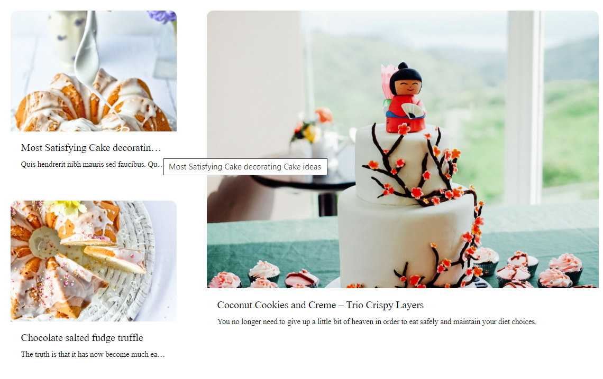
- ***Error***: _Khi tải trang sẽ lấy thông tin các blog từ server về và load vào phần menu. Khi xảy ra lỗi không lấy được thông tin sẽ thông báo đến người dùng_
  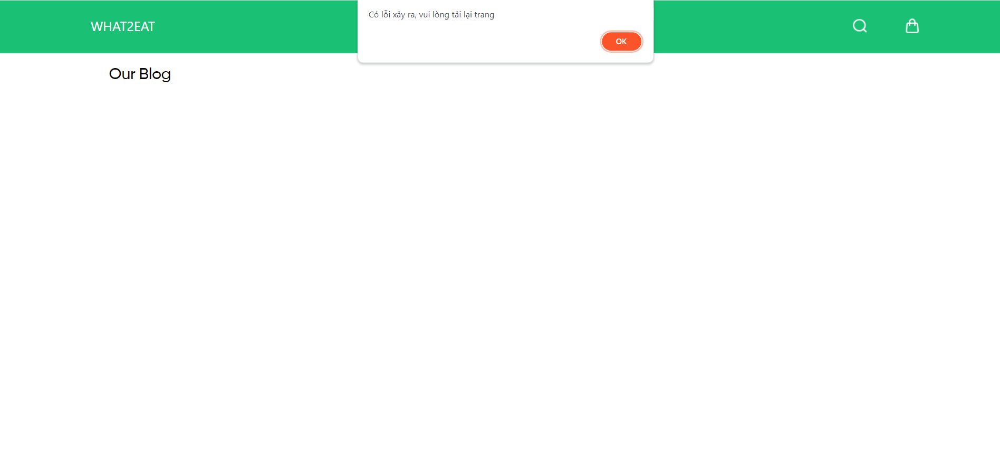

> ### 4. Contact

- ***Main interface***: _Giao diện chính_
  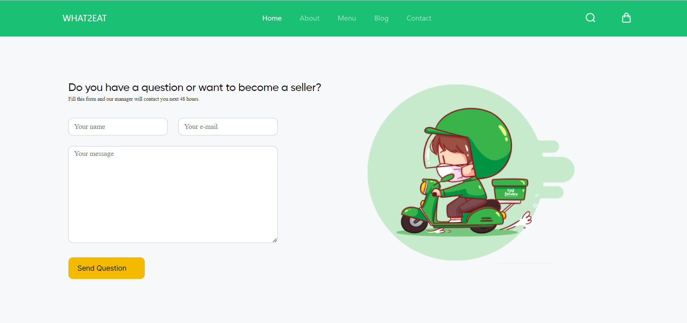
- ***Responsive***: _Giao diện tương thích với nhiều kích cỡ màn hình_
  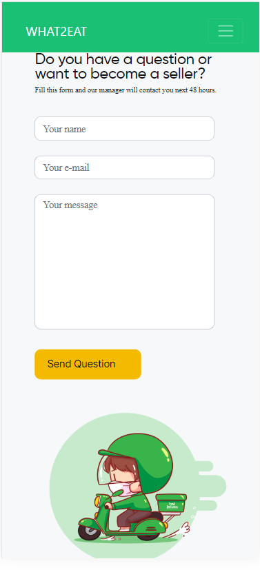
- ***Send question***: _Cho phép tạo mới dữ liệu và kiểm tra khi bấm nút gửi đi_
  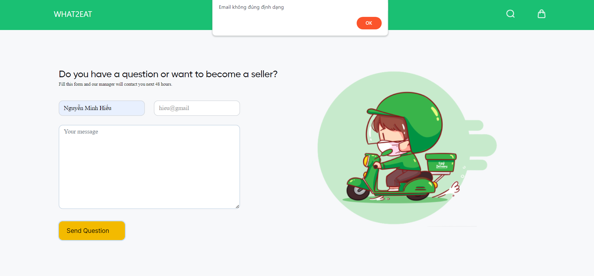
- ***Send question***: _Thông báo cho người dùng sau khi gửi câu hỏi thành công và ghi thông tin vào console. Xử lý ương tự nếu gặp lỗi_
  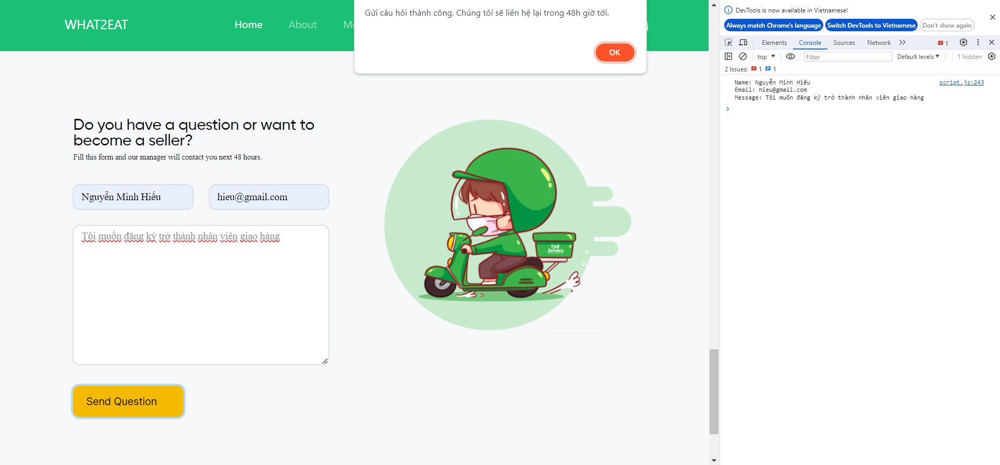

> ### 5. Footer

- ***Main interface***: _Giao diện chính_
  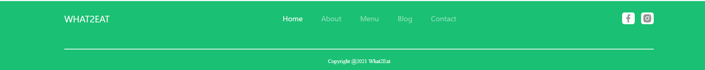
- ***Menubar***: _Tương tự thanh menu home, khi bấm vào các lựa chọn trên thanh menu footer thì trang web sẽ tự động trỏ đến các phần tương ứng, tuy nhiên thanh menu không được đặt cố định. Khi bấm vào các biểu tượng Social icon thì trang web sẽ tự trỏ đến trang chủ của mạng xã hội tương ứng trên 1 tab khác._
  
- ***Responsive***: _Giao diện tương thích với nhiều kích cỡ màn hình. Thanh menu cũng thay đổi theo kích cỡ màn hình khác nhau. Đồng thời sẽ có thanh cuộn để tránh việc thanh menu bị tràn khỏi giao diện chính_
  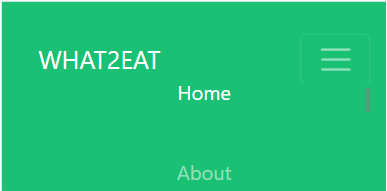

### **_Shopping Cart_** - **_Giỏ hàng_** gồm có 3 phần

> ### 1. Home
- Tương tự Home Page

> ### 2. Menu
- ***Main interface***: _Giao diện chính. Khi trang giỏ hàng được tải mới, danh sách sản phẩm sẽ được tự động cập nhật. Khi click vào biểu tượng "+ -" giỏ hàng cũng tự động cập nhật số lượng và giá cả(không làm thay đổi thứ tự giỏ hàng, tránh gây rối mắt). Khi bấm vào "remove item" hoặc khi số lượng = 0 thì sẽ tự động xóa sản phẩm khỏi giỏ hàng. Khi 2 trang web đang hoạt động song song, bất kì thay đổi nào của 1 bên thì bên tab còn lại đều tự động cập nhật_
  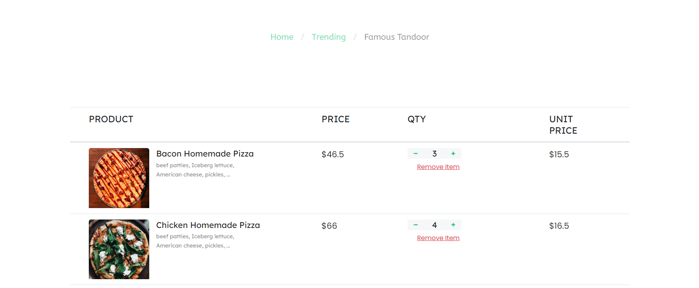
- ***Payment interface***: _Giao diện phần thanh toán. Giá cả sẽ được tự động cập nhật. Shipping fee mặc định là 20$. Coupon mặc định là No. Khi người dùng bấm nút "Radeem" sẽ kiểm tra voucher, xóa trắng ô input, nếu đúng sẽ thông báo và thay đổi giá trị coupon rồi trừ tiền_
  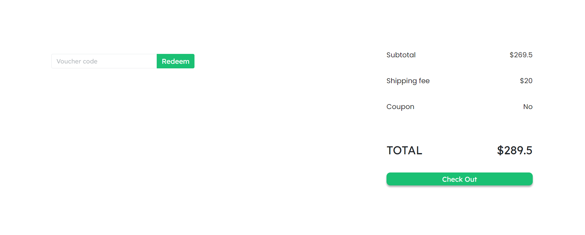
  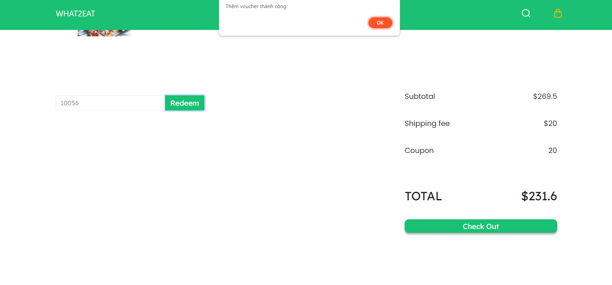
- ***Payment Window***: _Khi bấm "Check out" sẽ hiển thị lên 1 cửa sổ thanh toán. Trong cửa sổ này khi ta bấm "Go to payment" sẽ thực hiện kiểm tra dữ liệu và cảnh báo. Nếu dữ liệu đã hợp lệ sẽ thực hiện tạo đơn hàng với 2 trạng thái(có và không có mã giảm giá). Khi tạo đơn thành công sẽ ẩn cửa sổ này đi và hiện lên cửa sổ success. Bấm nút success sẽ ẩn cửa sổ đó đi và xóa toàn bộ giỏ hàng vừa đặt_
  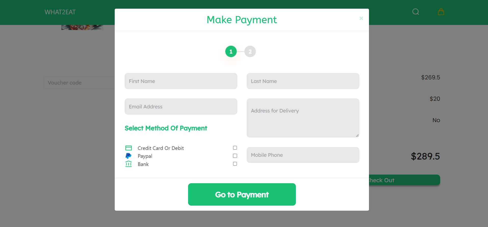
  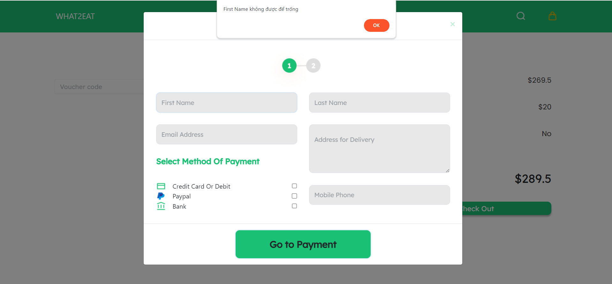
  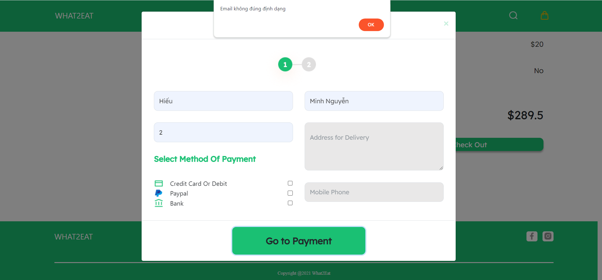
  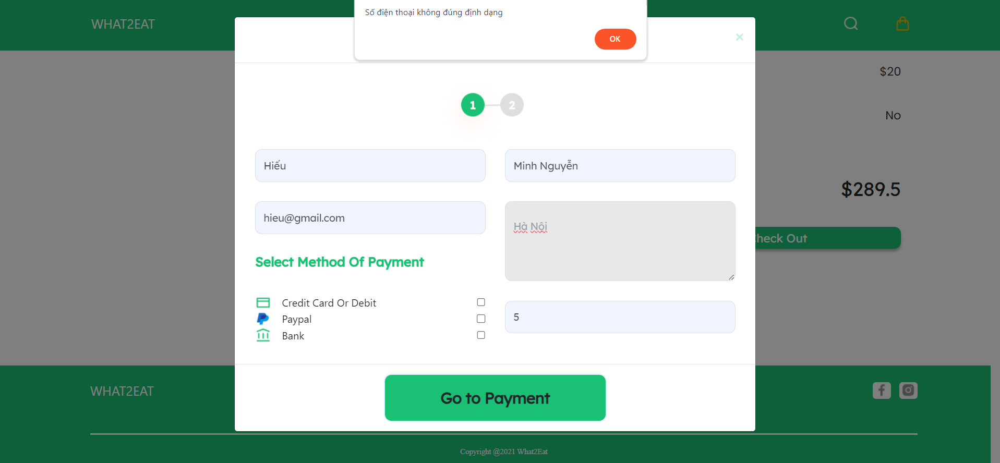
  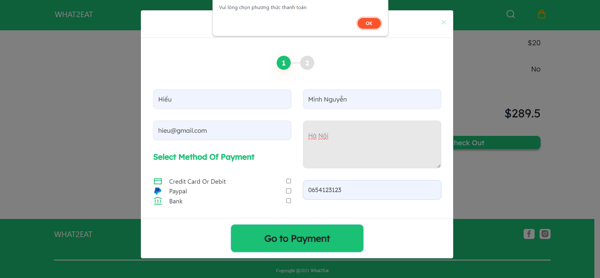
  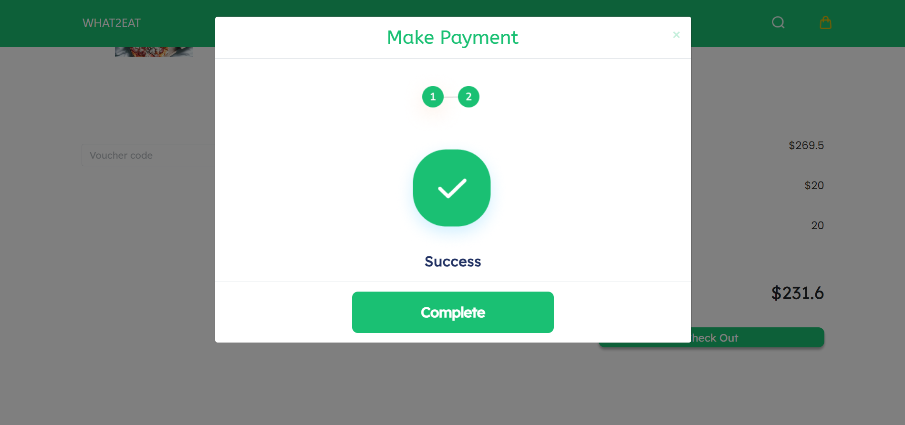
- ***Responsive***: _Giao diện tương thích với nhiều kích cỡ màn hình. Menu sẽ tự động thu nhỏ chữ và kích cỡ, khi màn hình quá nhỏ(mobile) thì sẽ có thanh cuộn để người dùng thao tác_
  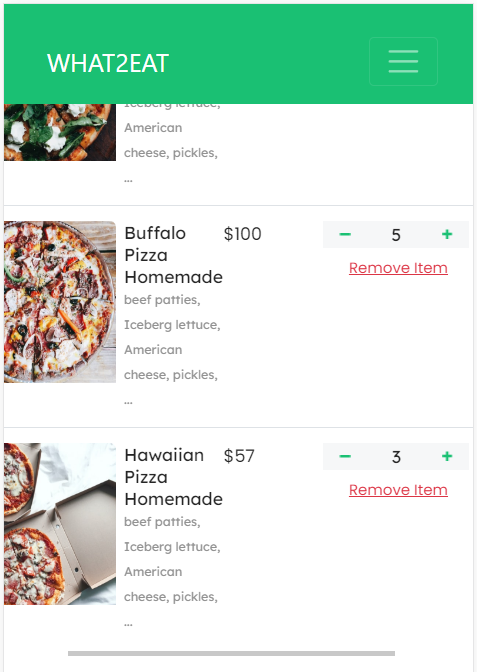
  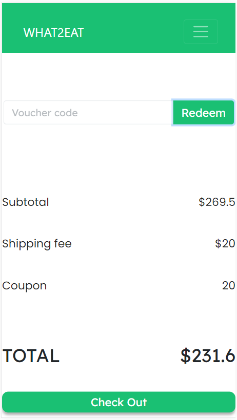
  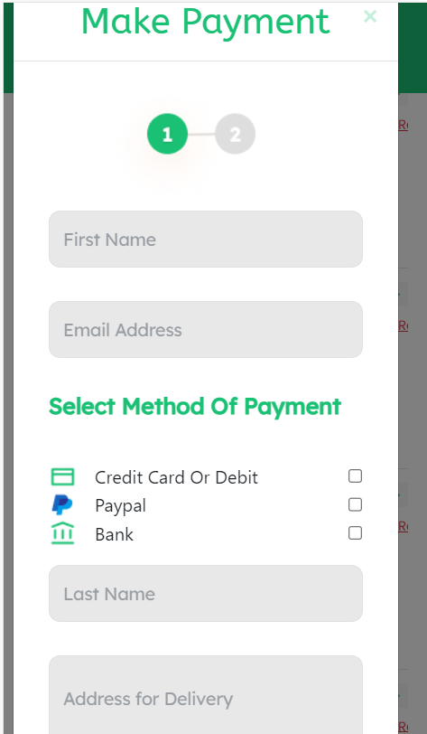

> ### 3. Footer
- Tương tự Home Page

## 📄 Description Admin Page

- ### **Admin page Food Ordering**, **Theo dõi danh sách đơn hàng, tạo mới, sửa và xóa đơn hàng**

## 🌟 Code Explanation
> ### 1. Hiển thị danh sách đơn hàng
- Khởi tạo DataTable
- Call API lấy danh sách sản phẩm rồi lưu vào biến toàn cục, load dữ liệu vào bảng
- Render thông tin ở các cột để hiển thị như mong muốn

> ### 2. Update đơn hàng
- Lắng nghe sự kiện click nút edit
- Hiển thị modal edit đơn hàng
- Sử dụng DataTable để lấy thông tin đơn hàng
- Lấy được thông tin đơn hàng rồi thì sẽ tiến hành đổ vào form trên modal update
- Call API để lấy thông tin voucher rồi lưu vào biến toàn cục, sử dụng voucherId trong thông tin đơn hàng để lọc và tìm voucher phù hợp để đưa vào form
- Khi nhấn update đơn hàng sẽ tiến hành thu thập dữ liệu, kiểm tra dữ liệu và call API check voucher hợp lệ
- Cuối cùng tiến hành call API để cập nhật đơn hàng, thông báo đến người dùng, đóng modal và tải lại dữ liệu

> ### 3. Xóa đơn hàng
- Lắng nghe sự kiện click nút xóa
- Hiển thị modal xóa sản phẩm
- Sử dụng DataTable để lấy thông tin mã đơn hàng
- Khi bấm xác nhận xóa đơn thì sẽ sử dụng mã đơn hàng sẽ tiến hành call API xóa đơn hàng
- Xóa xong sẽ thông báo đến người dùng, đóng modal và tải lại dữ liệu

## ✨ Feature

- ***Main interface***: _Giao diện chính hiển thị toàn bộ đơn hàng_
  
- ***Update Order***: _Update đơn hàng_
  
- ***Validate Update Order***: _Kiểm tra khi Update đơn hàng_
  
- ***Delete Order***: _Xóa đơn hàng_
  
- ***Responsive***: _Giao diện tương thích nhiều kích cỡ màn hình_
  

## 🧱 Technology

- Front-end:
  > 1. [Bootstrap 4](https://cdn.jsdelivr.net/npm/bootstrap@4.6.2/dist/css/bootstrap.min.css)
  > 2. [Jquery 3](https://cdn.jsdelivr.net/npm/jquery@3.7.0/dist/jquery.min.js)
  > 3. [DataTable 1.13.8](https://cdn.datatables.net/1.13.8/css/dataTables.bootstrap4.min.css)
  > 4. [Font Awesome 5](https://use.fontawesome.com/releases/v5.15.4/js/all.js)
  > 5. Ajax
  > 6. JSON
  > 7. Javascript
  > 8. Local Storage
